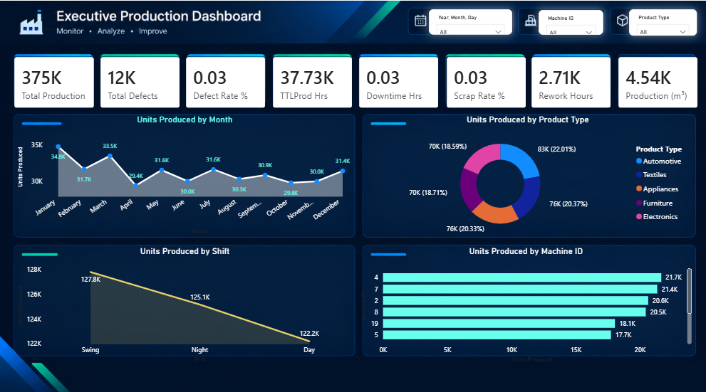

# 📊 Executive Production Performance & Manufacturing Analytics Dashboard

<p align="center">
  
</p>

<p align="center">
  <strong>Interactive Manufacturing Analytics Dashboard built with Microsoft Power BI</strong>
</p>

<p align="center">
  <a href="https://github.com/Nabeelahmad193221/Executive-Production-Performance-Dashboard">
    
  </a>
  
  
  
  
</p>

---

## 🚀 Project Overview

The **Executive Production Performance & Manufacturing Analytics Dashboard** is an interactive Power BI solution developed to transform manufacturing data into meaningful and actionable business insights.

The dashboard provides an executive-level view of key manufacturing performance indicators, including:

- 🏭 Production Performance
- 📦 Product-wise Production
- ⚙️ Machine Productivity
- 🔄 Shift Performance
- ⚠️ Defects & Defect Rate
- ⏱️ Downtime
- ♻️ Scrap Rate
- 🔧 Rework Hours
- 📊 Production Volume

### 🎯 Core Approach

**Monitor → Analyze → Identify → Improve**

The dashboard is designed to provide a centralized view of production and operational KPIs for faster performance analysis and reporting.

---

# 🎯 Project Objectives

The main objectives of this project are to:

- 📈 Monitor overall production performance
- 📅 Analyze monthly production trends
- 🏭 Evaluate machine-level productivity
- 🔄 Compare production across shifts
- 📦 Analyze production by product type
- ⚠️ Monitor defects and defect rate
- ⏱️ Track downtime and production hours
- ♻️ Monitor scrap and rework
- 📊 Create an executive-level KPI overview
- 💡 Support data-driven operational analysis

---

# 📌 Executive KPI Overview

| KPI | Description |
|---|---|
| 🏭 **Total Production** | Total units produced |
| ⚠️ **Total Defects** | Total defective units |
| 📉 **Defect Rate %** | Percentage of defective production |
| ⏱️ **Production Hours** | Total production operating hours |
| ⏸️ **Downtime Hours** | Total production downtime |
| ♻️ **Scrap Rate %** | Percentage of production classified as scrap |
| 🔧 **Rework Hours** | Hours spent on rework |
| 📦 **Production Volume (m³)** | Total production volume |

---

# 📊 Dashboard Features

## 📈 Production Trend Analysis

The monthly production trend provides a visual overview of production performance throughout the year.

### Key analysis

- Monthly production trends
- Production fluctuations
- Highest and lowest production periods
- Overall production movement
- Month-to-month performance comparison

---

## 📦 Product Type Analysis

Production is analyzed across multiple product categories:

- Automotive
- Textiles
- Appliances
- Furniture
- Electronics

This analysis provides visibility into production distribution across different product types.

---

## 🔄 Shift Performance

Production performance is compared across:

- ☀️ Day Shift
- 🌆 Swing Shift
- 🌙 Night Shift

This allows users to analyze production distribution and differences across operating shifts.

---

## 🏭 Machine Performance

Machine-level production analysis provides visibility into production output by Machine ID.

### Analysis includes

- Machine production volume
- High-production machines
- Lower-production machines
- Production distribution
- Machine-level performance comparison

---

# 🎛️ Interactive Filters

The dashboard includes interactive slicers that allow users to dynamically analyze the data.

```text
📅 Year / Month / Day
🏭 Machine ID
📦 Product Type
